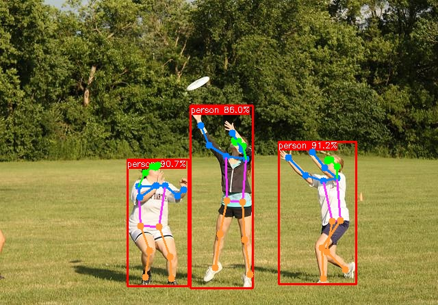

# YOLOv8_TensorRT_Jetson
YOLOv8(Detect、Segment、Pose、Obb、Class)移植到Nvidia Jetson Nx中，支持cuda中前后预处理加速。


### 写在前面

最近换了一份新工作，这份工作需要我基于Nvidia Jetson Orin Nx进行算法开发，之前的工作基本接触不到该款开发板，同时对TensorRT的部署也不了解。为了能够快速熟悉基于Nvidia开发板的开发，所以创建了本仓库。

本仓库是基于[YOLOv8-TensorRT](https://github.com/triple-Mu/YOLOv8-TensorRT)仓库进行二次开发的，适配了最新的TensorRT 10.x，与此同时，对于每个模块比较耗时的前后处理，可以使用cuda进行加速（在这里感谢腾讯元宝、chatgpt和claude帮我进行vibe coding)。

本项目是基于YOLOV8测试的，因为YOLO系列不同功能的后处理大致是一样的，因此应该可以扩展到YOLOV11当中(没测试过，但是应该可以)。


### 测试环境

- Nvidia Jetson Orin Nx 16G(Jetpack 6.2)
- CUDA:12.6
- cuDNN:9.3.0
- TensorRT:10.3.0
- OpenCV:4.10.0 with CUDA


### 推理

1. 推理之前需要在推理的环境使用`trtexec`将模型的权重从`onnx`转到`engine`格式；

2. 在每个模块中新建`build`文件夹；

3. 随后在该文件下，使用以下指令进行编译：

   ```bash
   $ cmake ..
   $ make -j8
   ```

4. 进行推理（参考）

   ```sh
   $ ./yolov8_seg ***.engine  ***.jpg
   ```


### 推理结果

- 目标检测推理结果

  

- 实例分割推理结果

  

- 关键点检测推理结果

  

- OBB目标检测推理结果

  

- 图像分类推理结果

  


### 写在后面

TensorRT框架的推理其实挺复杂的，至少比ncnn框架推理复杂。但是现在工作需要用到这一块，不得不逼自己学习。我觉得做任何事还是得下功夫才能成功，本仓库也是算做实践记录。基于cuda的前后处理几乎都是问各种AI，然后自己不断调试才成功的，里面的实现很多自己都没搞懂，因此后续需要花点功夫搞懂原理。

创作不易，如果觉得这个仓库还可以的话，麻烦给一个star，这就是对我最大的鼓励。


### Reference

- [YOLOv8-TensorRT](https://github.com/triple-Mu/YOLOv8-TensorRT)
